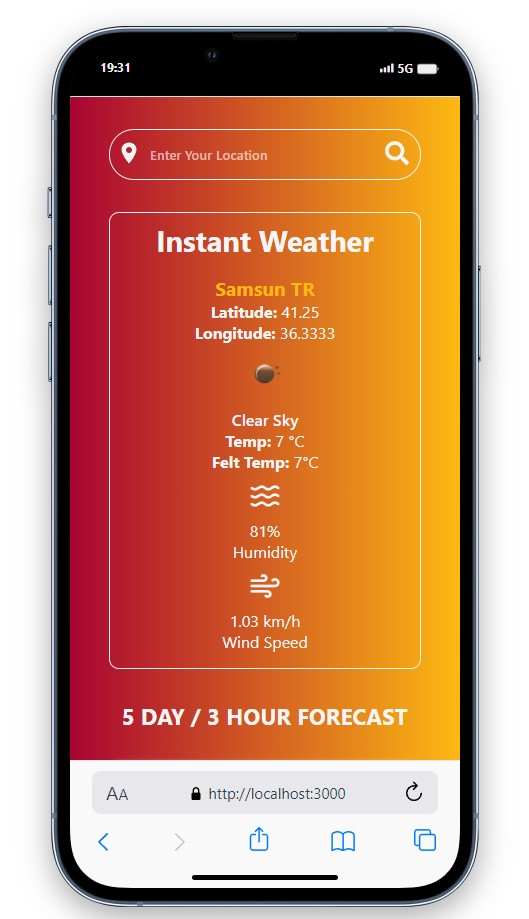
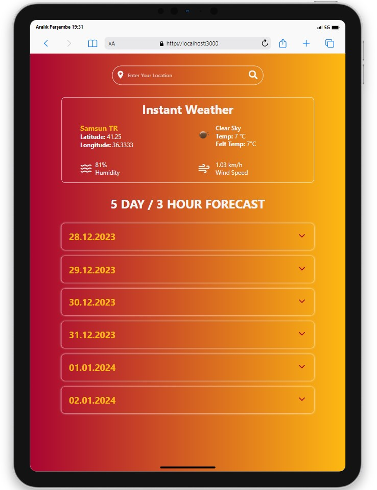
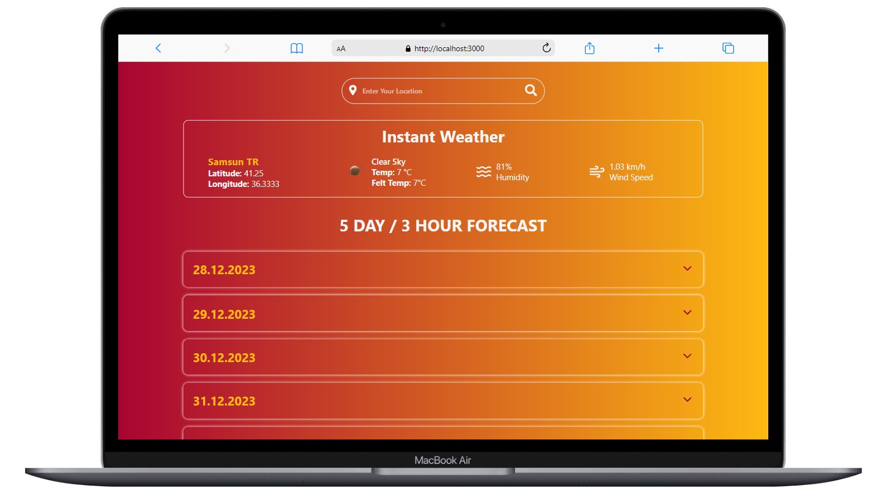

# React Weather App

<div align="center">
  
</div>

## About the Project

This project, created with React, is a website that utilizes the OpenWeatherMap API to display both weekly and real-time weather forecasts for any desired location.

## Live Demo

[React Weather App]()

## Features

- Instant and weekly weather forecast for a specific location.
- Each day can be expanded to view detailed weather information.
- Shows information such as temperature, felt temperature, humidity, wind speed, and pressure.

## Technologies Used

- React
- Axios for API requests
- [OpenWeatherMap API](https://openweathermap.org/) for weather data
- Icons from [React Icons](https://react-icons.github.io/react-icons/)
- Styling with CSS (module)

## Project Skeleton

```
React Weather App (folder)
|
|----readme.md         
SOLUTION
├── public
│     └── index.html
├── src
│    ├── assets
│    │       └── [images]
│    ├── components
│    │       ├── guncel
│    │       │     ├── Guncel.css 
│    │       │     └── Guncel.jsx 
│    │       ├── haftalik     
│    │       │     ├── Haftalik.css 
│    │       │     └── Haftalik.jsx   
│    │       └── search     
│    │             ├── Search.css 
│    │             └── Search.jsx 
│    ├── pages
│    │       └── Home.jsx
│    ├── App.js
│    ├── App.css
│    └── index.js
├── package.json
└── yarn.lock
```

## Screenshots

<div align="center">
  
  
  
</div>

## Compatibility

The project is compatible with both wide-screen computers and mobile devices.

## Usage

- Get an API key from [OpenWeatherMap](https://openweathermap.org/) and replace process.env.REACT_APP_API_KEY in Guncel.jsx and Haftalik.jsx with your API key.

## Acknowledgments

- Weather data provided by [OpenWeatherMap](https://openweathermap.org/)